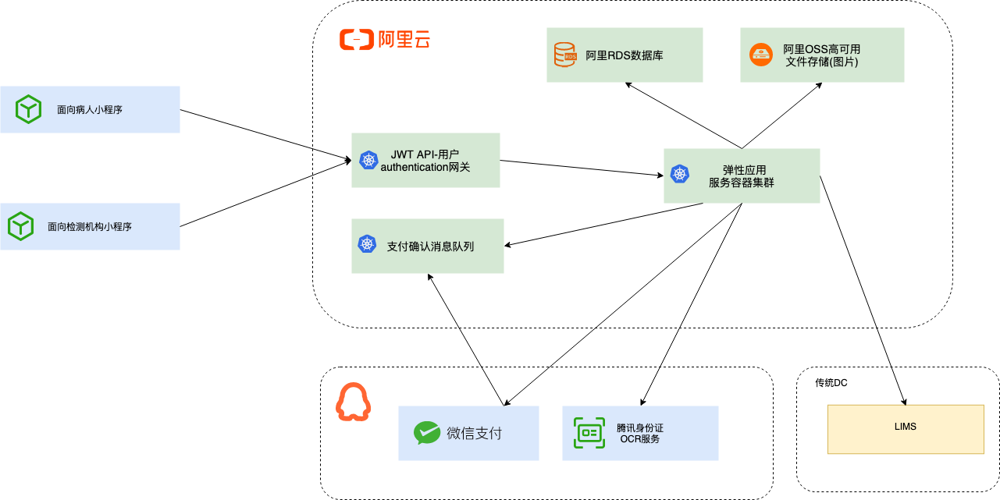

# 快捷检测微信小程序 
FTT Fast Testing Tracking (正式项目名待定)

#### 项目背景

应用主要用途:
    - 收录被检测人信息,通常包含联系方式(电话),身份证,住址等
    - 收录检测任务信息,通常包含样本识别号(条码), 检测项目等
    - 在线支付检测项目费用
    - 收录开具发票信息

#### 主要业务流程干系人及APP用户
###### 干系人
- 医院医生及护士
- 检测机构工作人员
- 待检测病患

###### APP用户
- 检测机构工作人员
- 待检测病患

#### 业务边界及关键事件

#### 基础技术架构设计

#### 功能清单与业务流程

####### 检测机构端
- 登陆与权限认证
  - 检测机构端小应用通过发送用户名密码发起授权申请
  - GateKeeper授权代理服务转发请求到LIMS验证用户身份
  - GateKeeper根据授权结果返回JWT返回客户端确认授权结果
  - GateKeeper可以配置用户角色/类型对于API的访问权限
  - 每次请求到达GateKeeper，GateKeeper验证请求头中的JWT的合法性
- 创建检测任务
  - 线下支付业务线
    - 扫样本条码获取样本唯一标识符/手动输入条码  
    - 申请但拍照并通过应用服务器上传到OSS
    - 选择项目及录入备注等其他基本信息
    - 通过样本标识符创建检测订单(订单状态为已支付)
  - 线上支付业务
    - 扫样本条码获取样本唯一标识符/手动输入条码
    - 身份证拍照并上传至应用服务器
        - 应用服务器调用腾讯身份证信息识别服务获取身份证信息
    - 手动输入身份信息
        - 通过输入身份证号或名称推荐系统中已有的记录避免重复输入
    - 输入/选择检测项目
        - 需要确定项目列表固定还是从LIMS获取
    - 创建检测订单
        - 调取LIMS根据所选项目获取订单价格
        - 调用微信支付网管创建支付订单
        - 通过样本标识符创建检测订单(订单状态为未支付)
    - 订单支付
      - 选择是否开具发票
        - 手工录入发票信息
        - 根据输入抬头信息等，匹配系统中已录入的发票信息并推介给用户
      - 选择支付方式
          - 微信支付
            - 返回支付二维码数据到小应用
            - 在小程序中展示支付二维码
            - 支付完成后更新订单支付状态
            - 小程序轮训支付结果确定订单状态
          - 现金支付
            - 输入并提交已收现金数额，更新状态至已付款
    - 关闭订单(订单状态为已关闭，此操作仅对未支付订单有效)
    - 样本退回(订单状态为已退款, 此操作仅为已支付订单有效)
        - 如果支付方式为微信支付，向微信支付申请退款，资金原路返回
        - 如果支付方式为现金，人工退款，并在确认后更新订单状态
- 订单查询
    - 获取当前用户的历史订单(是否限制时间范围?)
    - 浏览所选订单详细信息

####### 个人端
- 报告查询, 通过输入身份证号和电话号码查询一定时间范围内的检测结果

####### 接口API
- (私有)已支付订单查询接口
  - LIMS可以调用这个接口获取已支付订单的列表，将前置数据库收录的检测订单录入到LIMS内部数据库
  - GateKeeper创建API Key和API Security对LIMS做service to service的认证，保证次接口无法通过其他途径访问  
- (公有)报告查询接口  
  - 调用LIMS查询检测报告, 输入参数为手机号与身份证号，LIMS返回报告(报告是以什么形式返回？)
    
###### 其他
- 容器化构建(Docker)
- 自动化发布到阿里云(Circle CI)